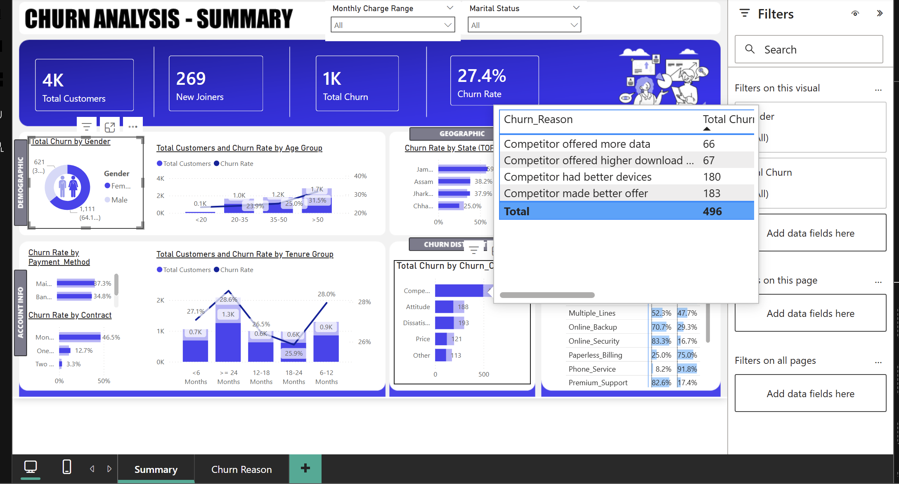

# CUSTOMER CHURN ANALYSIS DASHBOARD
Why is customer churn analysis important to businesses?

I built an ETL pipeline by extracting raw customer data from Excel, transforming and normalizing it using SQL, and loading it into Power BI for churn analysis and reporting.

What the Dashboard Did
My dashboard tracked the full customer lifecycle and identified where and why customers churn.

As a business intelligence analyst, I needed to understand the "why" of my dashboard design. 

This reminded me of a literature review I conducted on the impacts of machine learning on data-driven marketing.

My research pointed out that marketing messages are deemed effective only if they reach the right audience.
The top priority for most, if not all businesses, is churn management, and churn prediction forms an integral part of these programs.

One may ask, “What is churn prediction?”. It simply means predicting which customers will stop using a business’s products or services. 

Ascarza (2018) suggested that businesses should target customers whose decisions to churn would be dissuaded or decreased if the company intervened.

This brings me to the question I posed myself at the start of building this dashboard. Why Customer Churn Analysis?

Acquiring a new customer can cost more compared to keeping an existing one.

Churn analysis helps businesses:
1. Improve lifetime customer value (CLV)
2. Identify high-risk vs. loyal customers
3. Identify profitable vs. unprofitable churn
4. Identify behavioral patterns (usage drops, complaints, inactivity)
5. Attain useful customer segmentation

By studying churned customers, marketers can:
1. Exclude low-retention segments
2. Adjust channels that bring loyal vs. fleeting customers
3. This directly boosts ROI on advertisement revenue 
4. It enables proactive retention campaigns 

# PROJECT SCREENSHOT

